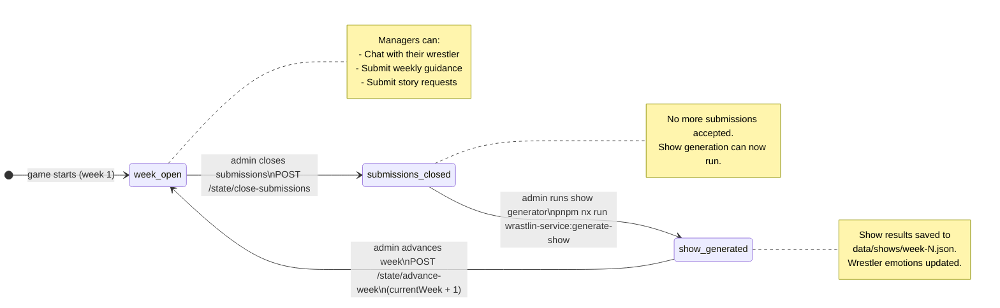
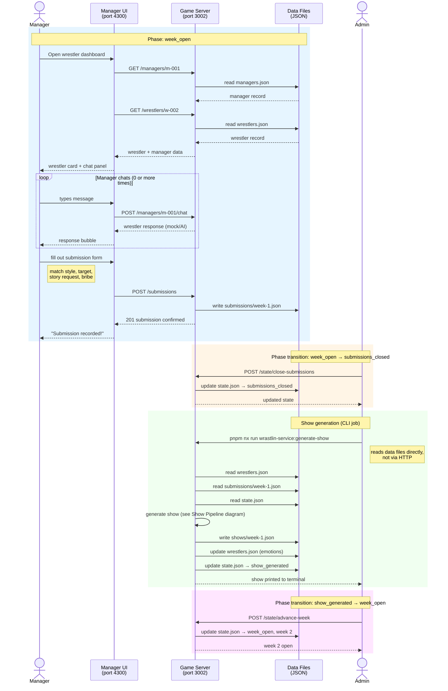
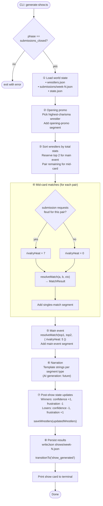
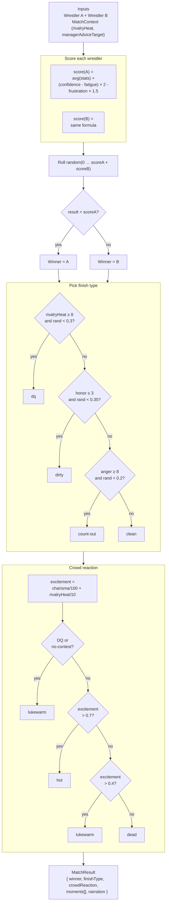
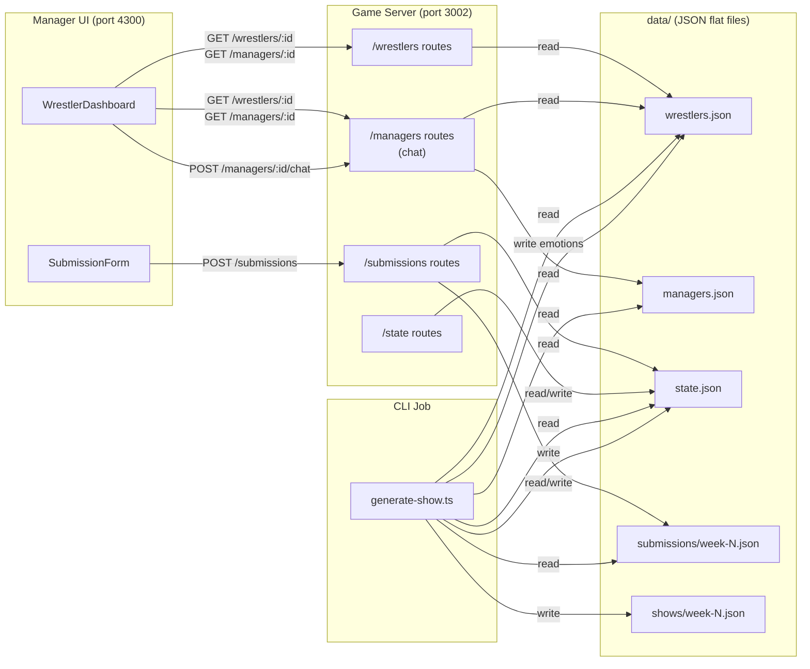
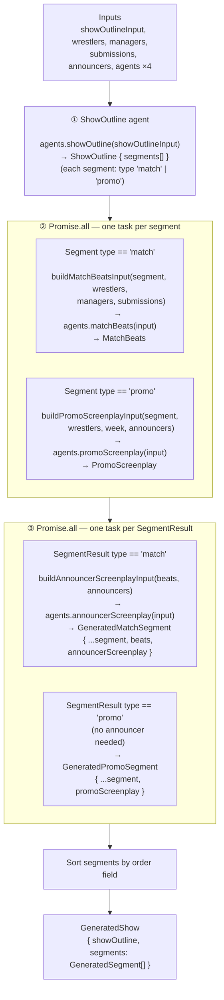
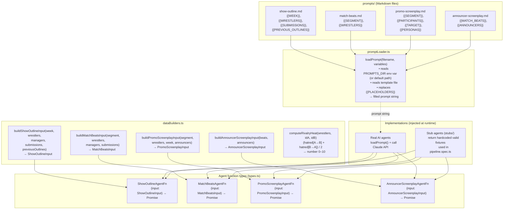

# Wrastlin Flow Diagrams

---

## 1. Weekly Game Loop — State Machine

The game advances through three phases each week. Only one transition is possible at a time.

---

## 2. Weekly Game Loop — Full Actor Flow

Who does what, in what order, across a full week.

---

## 3. Show Generation Pipeline

What happens inside `generateShow()` when the CLI script runs.

---

## 4. Match Resolution — Decision Logic

How a single match outcome is determined (fully deterministic).

---

## 5. Data Flow — What Files Exist and Who Reads/Writes Them

---

## 6. AI Show Generation Pipeline — `runShowPipeline`

What happens inside `runShowPipeline()` — the replacement for the old deterministic `generateShow()`. Three async steps; steps 2 and 3 are fully parallel across segments.

---

## 7. Agent Architecture — Prompts, Inputs, and Dependency Injection

How each AI agent is wired: prompt templates on disk, data builders transform raw game data into structured inputs, and the `agents` object is injected so stubs can replace real AI calls in tests.

